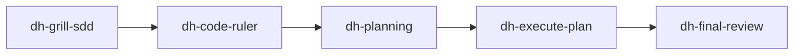

# Demo Project

Demo folder that links the `dev-harness-skills` plugin: run it isolated and
exercise the bundled harness (7 agents, 15 skills, `dh_*` tools).

## Quickstart

```bash
cd demo-project
./demo.sh          # opencode TUI with the plugin loaded
./demo.sh validate # assert agents/skills/tools registration (non-interactive)
```

## How it is wired

1. `opencode.jsonc` — `"plugins": ["../"]` links the parent repo (plugin
   package directory form, per the v2 loading contract).
2. `.obsidian/` — the project root IS an Obsidian vault (dh-setup mandate),
   so `notesmd-cli search-content "..." --vault "demo-project"` works.
3. `docs/` — every generated document follows the documentation contract:
   markdown primary, csv/json/yaml/xml complementary, mermaid for workflows,
   ASCII wireframes for UI, obsidian frontmatter.

## Example workflow (plugin usage)



## Demo UI (ASCII wireframe)

```
+--------------------------------------------------+
| demo-project          [sdd] [plan] [review] [docs]|
+--------------------------------------------------+
|  Harness loaded: 7 agents / 15 skills / dh_* tools|
|  Try:  ask dh-software-architect to plan a task   |
+--------------------------------------------------+
```

## Tabular data demo

`docs/data/people.csv` is queryable through the plugin's DuckDB tools:

```
dh_read_sheet { path: "demo-project/docs/data/people.csv", query: "SELECT name FROM read_csv_auto(?) WHERE age > 30" }
```