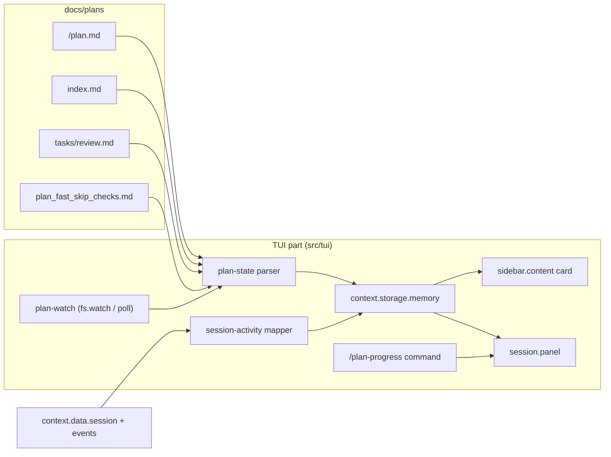

# TUI Plan Progress Architecture

```mermaid
flowchart LR
  subgraph Plans["docs/plans"]
    IDX["index.md"]
    PLAN["<slug>/plan.md"]
    REVIEW["tasks/review.md"]
    LEDGER["plan_fast_skip_checks.md"]
  end

  subgraph TUI["TUI part (src/tui)"]
    PARSE["plan-state parser"]
    WATCH["plan-watch (fs.watch / poll)"]
    ACT["session-activity mapper"]
    STORE["context.storage.memory"]
    SIDEBAR["sidebar.content card"]
    PANEL["session.panel"]
    CMD["/plan-progress command"]
  end

  SESSION["context.data.session + events"]

  PLAN --> PARSE
  IDX --> PARSE
  REVIEW --> PARSE
  LEDGER --> PARSE
  WATCH --> PARSE
  PARSE --> STORE
  SESSION --> ACT
  ACT --> STORE
  STORE --> SIDEBAR
  STORE --> PANEL
  CMD --> PANEL
```
