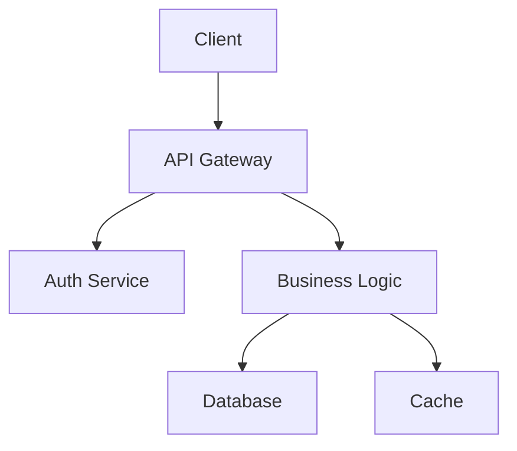

# Format Guide

## Step 3: Format Selection

### Markdown (default)

Standard Markdown with Obsidian-compatible extensions:

```markdown
# Heading 1
## Heading 2

**Bold**, *italic*, `code`

- Bullet lists
- With nesting

1. Numbered
2. Steps

| Table | Header |
|-------|--------|
| Cell  | Cell   |

> Blockquotes for callouts

```language
Code blocks with language
```

<!-- Comments for TODOs -->
```

### HTML

Use only when the user explicitly requests HTML or when Markdown can't express the layout:

```html
<!DOCTYPE html>
<html lang="en">
<head>
  <meta charset="UTF-8">
  <title>{Title}</title>
  <style>
    /* Minimal, clean styling */
    body { max-width: 800px; margin: 0 auto; padding: 2rem; font-family: system-ui; }
    pre { background: #f5f5f5; padding: 1rem; border-radius: 4px; overflow-x: auto; }
    table { border-collapse: collapse; width: 100%; }
    th, td { border: 1px solid #ddd; padding: 8px; text-align: left; }
    th { background: #f0f0f0; }
  </style>
</head>
<body>
  {content}
</body>
</html>
```

### Mermaid Diagrams

Embed Mermaid diagrams inside Markdown code blocks with language `mermaid`:

```markdown
## System Architecture


```

**Supported diagram types:**

| Type            | Directive          | Use case                                  |
|-----------------|-------------------|-------------------------------------------|
| Flowchart       | `graph TD` / `graph LR` | Process flows, decision trees        |
| Sequence        | `sequenceDiagram` | API call flows, event chains              |
| Class diagram   | `classDiagram`    | Object models, type hierarchies           |
| State diagram   | `stateDiagram-v2` | State machines, lifecycle                 |
| ER diagram      | `erDiagram`       | Database schemas, entity relationships    |
| Gantt chart     | `gantt`           | Timelines, roadmaps                       |
| Pie chart       | `pie`             | Data distribution                         |
| Mindmap         | `mindmap`         | Brainstorming, topic organization         |

**Best practices:**
- Keep diagrams focused — one concept per diagram
- Use `LR` (left-to-right) for wide flows, `TD` (top-down) for deep hierarchies
- Label edges with verbs: `A -->|calls| B`
- Style consistently across related diagrams
