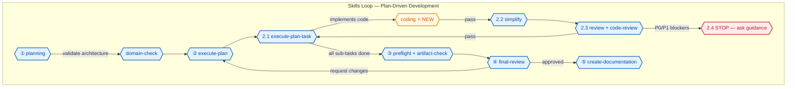

# Skills Index — dev-harness-skills plugin

> The plugin bundles **14 skills** (user-mandated scoped manifest + the
> `dh-grill-sdd` SDD interviewer + `dh-setup` harness setup).
> Loading a skill injects its instructions and resources into the current
> conversation. Plans are **phased** (phases → sub-tasks, dual status
> markers); plan lifecycle is managed via the bundled `dh` tools
> (`dh_plan_read`, `dh_plan_update_status`, `dh_plan_create` —
> see `docs/LOADING.md`). All plan execution follows the skills loop below.

## The skills loop (verbatim)

Plans are **phased**: `## Phases` → `### Phase N: <title>` (with `- **Status:**`)
→ `#### Sub-Task N.M: <title>` (with full fields + `- **Status:**`). Format
contract: `skills/planning/references/phased-plan-template.md`.

1. `dh-planning` → use `dh-domain-check` while planning (creates phased plans)
2. `dh-execute-plan` (iterates phases in order → their sub-tasks)
   2.1 `dh-execute-plan-task` → use `dh-coding`
   2.2 `dh-simplify`
   2.3 `dh-review` + `dh-code-review`
   2.4 IF hard blockers → stop and ask guidance; otherwise keep `dh-execute-plan-task` loop
3. `dh-preflight` + `dh-artifact-check`
4. `dh-final-review` (reports per-phase completion)
5. `dh-create-documentation`

**Step 2.4 halts automation.** On a hard blocker (3 consecutive validation
failures, unresolved P0/P1 review findings, or missing preconditions), report
it and ask the user for guidance — never silently continue or mark sub-tasks
Complete around a blocker (see repo-root `AGENTS.md`). A blocked sub-task
blocks its phase.

**Plan lifecycle tools:** use `dh_plan_read` to parse a phased plan,
`dh_plan_update_status` to flip phase/sub-task status markers, and
`dh_plan_create` to scaffold a new plan — fall back to direct plan.md
edits only when the tools are unavailable.

## The 12 bundled skills

| Skill | Role in the loop |
|---|---|
| [`dh-planning`](dh-planning/SKILL.md) | Step 1 — write plans (`docs/plans/<slug>/plan.md`), interview mode |
| [`dh-domain-check`](dh-domain-check/SKILL.md) | During planning + before complex implementation — DDD/SOLID validation |
| [`dh-execute-plan`](dh-execute-plan/SKILL.md) | Step 2 — orchestrate full plan execution, review each sub-task, resume mode |
| [`dh-execute-plan-task`](dh-execute-plan-task/SKILL.md) | Step 2.1 — execute one sub-task (project-type-aware delegation) |
| [`dh-coding`](dh-coding/SKILL.md) | **NEW** — TDD best practices; reads `CODE_RULES.md` at project root |
| [`dh-simplify`](dh-simplify/SKILL.md) | Step 2.2 — reuse/quality/efficiency pass on changed code (software only) |
| [`dh-review`](dh-review/SKILL.md) | Step 2.3 — verify a sub-task against acceptance criteria |
| [`dh-code-review`](dh-code-review/SKILL.md) | Step 2.3 — code-level correctness/security/robustness review |
| [`dh-preflight`](dh-preflight/SKILL.md) | Step 3 — run full test/lint/static-analysis gate |
| [`dh-artifact-check`](dh-artifact-check/SKILL.md) | Step 3 — validate build artifacts + deploy scripts |
| [`dh-final-review`](dh-final-review/SKILL.md) | Step 4 — plan-level sign-off verdict |
| [`dh-create-documentation`](dh-create-documentation/SKILL.md) | Step 5 — generate/update project docs (vault = `{project_root}`, docs under `{project_root}/docs`) |
| [`dh-grill-sdd`](dh-grill-sdd/SKILL.md) | Pre-planning — interviews the user and produces `./docs/plans/<slug>/sdd.md` (the requirements contract `dh-planning` consumes) |
| [`dh-setup`](dh-setup/SKILL.md) | Environment — audits system software (chrome/uv/nvm/osv-scanner/docker/jq/xq/yq/graphify/phpenv), user MCPs + plugins, and scaffolds project QA (hooks + stack tools) |

## Agents

The 6 manifest agents used by the skills loop (see `AGENTS.md` for
runtime delegation normalization — `@build`/`@senior-*`/`@plan` map to the
manifest names):

`dh-software-architect` (planning, execute-plan, create-documentation) ·
`dh-software-engineer` (execute-plan-task, coding) · `dh-reviewer` (simplify,
review, code-review) · `dh-final-reviewer` (final-review) · `dh-executor` (all
validation/execution) · `dh-explorer` (codebase exploration).

## Out of scope

Commands, prompts, and all other harness content from `~/.agents` are
intentionally NOT bundled (user-mandated manifest). See
[`docs/EXTRACTION.md`](../docs/EXTRACTION.md).