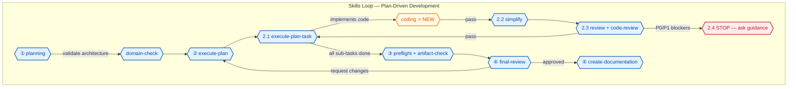

# Skills Index — dev-harness-skills plugin

> The plugin bundles exactly **12 skills** (user-mandated scoped manifest).
> Loading a skill injects its instructions and resources into the current
> conversation. All plan execution follows the skills loop below.

## The skills loop (verbatim)

1. `planning` → use `domain-check` while planning
2. `execute-plan`
   2.1 `execute-plan-task` → use `coding`
   2.2 `simplify`
   2.3 `review` + `code-review`
   2.4 IF hard blockers → stop and ask guidance; otherwise keep `execute-plan-task` loop
3. `preflight` + `artifact-check`
4. `final-review`
5. `create-documentation`

**Step 2.4 halts automation.** On a hard blocker (3 consecutive validation
failures, unresolved P0/P1 review findings, or missing preconditions), report
it and ask the user for guidance — never silently continue or mark sub-tasks
Complete around a blocker (see repo-root `AGENTS.md`).

## The 12 bundled skills

| Skill | Role in the loop |
|---|---|
| [`planning`](planning/SKILL.md) | Step 1 — write plans (`docs/plans/<slug>/plan.md`), interview mode |
| [`domain-check`](domain-check/SKILL.md) | During planning + before complex implementation — DDD/SOLID validation |
| [`execute-plan`](execute-plan/SKILL.md) | Step 2 — orchestrate full plan execution, review each sub-task, resume mode |
| [`execute-plan-task`](execute-plan-task/SKILL.md) | Step 2.1 — execute one sub-task (project-type-aware delegation) |
| [`coding`](coding/SKILL.md) | **NEW** — TDD best practices; reads `CODE_RULES.md` at project root |
| [`simplify`](simplify/SKILL.md) | Step 2.2 — reuse/quality/efficiency pass on changed code (software only) |
| [`review`](review/SKILL.md) | Step 2.3 — verify a sub-task against acceptance criteria |
| [`code-review`](code-review/SKILL.md) | Step 2.3 — code-level correctness/security/robustness review |
| [`preflight`](preflight/SKILL.md) | Step 3 — run full test/lint/static-analysis gate |
| [`artifact-check`](artifact-check/SKILL.md) | Step 3 — validate build artifacts + deploy scripts |
| [`final-review`](final-review/SKILL.md) | Step 4 — plan-level sign-off verdict |
| [`create-documentation`](create-documentation/SKILL.md) | Step 5 — generate/update project docs |

## Agents

The 6 manifest agents used by the skills loop (see `AGENTS.md` for
runtime delegation normalization — `@build`/`@senior-*`/`@plan` map to the
manifest names):

`software-architect` (planning, execute-plan, create-documentation) ·
`software-engineer` (execute-plan-task, coding) · `reviewer` (simplify,
review, code-review) · `final-reviewer` (final-review) · `executor` (all
validation/execution) · `explorer` (codebase exploration).

## Out of scope

Commands, prompts, and all other harness content from `~/.agents` are
intentionally NOT bundled (user-mandated manifest). See
[`docs/EXTRACTION.md`](../docs/EXTRACTION.md).