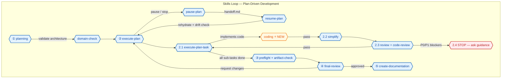

# Skills Index — dev-harness-skills plugin

> The plugin bundles **27 skills** (incl. `dh-grill-sdd` SDD interviewer,
> `dh-setup` harness setup, `dh-contingency` planning support, `dh-research`
> source-cited research, and `dh-pause-plan` / `dh-resume-plan` lifecycle
> support).
> Loading a skill injects its instructions and resources into the current
> conversation. Plans are **phased** (phases → sub-tasks, dual status
> markers); plan lifecycle is managed via the `dh` MCP server tools
> (`dh_plan_read`, `dh_plan_update_status`, `dh_plan_create` —
> see `docs/LOADING.md`). All plan execution follows the skills loop below.

```mermaid
graph TB
  %% ── Plan-Driven Development (core pipeline) ──
  subgraph PDD["Skills Loop — Plan-Driven Development"]
    PL{{"① planning"}}
    DC{{"domain-check"}}
    EP{{"② execute-plan"}}
    EPT{{"2.1 execute-plan-task"}}
    PA{{"pause-plan"}}
    RS{{"resume-plan"}}
    CD{{"coding ⭐ NEW"}}
    SM{{"2.2 simplify"}}
    RV{{"2.3 review + code-review"}}
    PR{{"③ preflight + artifact-check"}}
    FR{{"④ final-review"}}
    DOC{{"⑤ create-documentation"}}

    PL -- "validate architecture" --> DC
    DC --> EP
    EP --> EPT
    EP -- "pause / stop" --> PA
    PA -- "handoff.md" --> RS
    RS -- "rehydrate + drift check" --> EP
    EPT -- "implements code" --> CD
    CD -- "pass" --> SM
    SM --> RV
    RV -- "pass" --> EPT
    RV -- "P0/P1 blockers" --> STOP{{"2.4 STOP — ask guidance"}}
    EPT -- "all sub-tasks done" --> PR
    PR --> FR
    FR -- "approved" --> DOC
    FR -- "request changes" --> EP
  end

  classDef pdd fill:#e3f2fd,stroke:#1565c0,stroke-width:2px,color:#0d47a1
  classDef new fill:#fff8e1,stroke:#f57f17,stroke-width:2px,color:#e65100
  classDef stop fill:#ffebee,stroke:#c62828,stroke-width:2px,color:#b71c1c
  class PL,EP,EPT,PA,RS,RV,PR,FR,DOC,DC,SM pdd
  class CD new
  class STOP stop
```

## The skills loop (verbatim)

Plans are **phased**: `## Phases` → `### Phase N: <title>` (with `- **Status:**`)
→ `#### Sub-Task N.M: <title>` (with full fields + `- **Status:**`). Format
contract: `skills/dh-planning/references/phased-plan-template.md`.

1. `dh-planning` → use `dh-domain-check` while planning (creates phased plans)
2. `dh-execute-plan` (schedules the ready set from the phase/sub-task dependency graph; legacy plans iterate in order)
   2.1 `dh-execute-plan-task` → use `dh-coding`
   2.2 `dh-simplify`
   2.3 `dh-review` + `dh-code-review`
   2.4 IF hard blockers → stop and ask guidance; otherwise keep `dh-execute-plan-task` loop
3. `dh-preflight` + `dh-artifact-check`
4. `dh-final-review` (reports per-phase completion)
5. `dh-create-documentation` (also writes the evolution and observation notes)

**Step 2.4 halts automation.** On a hard blocker (3 consecutive validation
failures, unresolved P0/P1 review findings, or missing preconditions), report
it and ask the user for guidance — never silently continue or mark sub-tasks
Complete around a blocker (see repo-root `AGENTS.md`). A blocked sub-task
blocks its phase.

**Pause/resume (cross-cutting).** Pause writes `docs/plans/<slug>/handoff.md`
with the active phase/sub-task, git state, decisions, blockers, validation, and
next steps without changing plan statuses. Resume validates the handoff,
detects drift, rehydrates context, marks it `resumed`, and re-enters step 2.
`dh-execute-plan` redirects when a paused handoff exists; it is not a fourth
status.

**Fast execution (alternative).** `dh-execute-plan-fast` runs the same phased
plan from `docs/plans/<slug>/plan_fast.md` with no per-task gates. Status is
mirrored to both `plan_fast.md` and `plan.md`, skipped checks are appended to
`plan_fast_skip_checks.md`, and the critical gates (alignment, simplify,
code-review, domain-check when architectural, preflight, artifact-check, final
review, docs, semver) run once across plan end. `dh-execute-plan-task-fast`
handles one sub-task; `dh_plan_fast_sync` + `dh-review` Plan Alignment Mode
verify mirror alignment.

**Parallel scheduling (both modes).** Phases/sub-tasks may declare
`Parallelizable`, `Depends on`, `Files/Scope`, and `Isolation`; the shared
scheduler in
[`dh-execute-plan/references/parallel-scheduler.md`](dh-execute-plan/references/parallel-scheduler.md)
dispatches the ready set up to 3 workers by default (hard cap 8), allows several
`In Progress` sub-tasks, and keeps status/ledger/commit writes with the
orchestrator. Workers (`parallel-worker` mode of either task skill) implement one
exact sub-task and return a result envelope; they never write plans. Missing
fields default to `no`/`None`/`None`/`shared`, so legacy plans stay sequential.

**Plan lifecycle tools:** use `dh_plan_read` to parse a phased plan
(including each sub-task's `delegatedTo` and parallel metadata —
`parallelizable`, `dependsOn`, `filesScope`, `isolation`), `dh_plan_update_status` to flip
phase/sub-task status markers, and `dh_plan_create` to scaffold a new plan
(passing `delegatedTo` for every sub-task; optional parallel metadata is
rendered when supplied) — fall back to direct plan.md edits
only when the tools are unavailable. These tools are exposed by the project-scope `dh` MCP server; under Code Mode they are called as `tools.dh.<tool>`, and `dh_<tool>` is the tool's normalized name (permission actions match `dh_*`).

## Workspace behavior

All 27 skills stay workspace-aware. The workspace root owns `docs/plans` and the
research registry `docs/research`; `dh-setup` writes the workspace map
(`WORKSPACE.md`, root first, else `docs/WORKSPACE.md`) with packages and
per-package commands; plans declare affected packages in `## Workspace Impact`.
Standalone repositories keep the single-root behavior unchanged.

| Area | Reference |
|---|---|
| Roots, anchoring, execution record | [`../docs/plans/harness-monorepo-awareness/workspace-contract.md`](../docs/plans/harness-monorepo-awareness/workspace-contract.md) · [`dh-planning/references/execution-record.md`](dh-planning/references/execution-record.md) |
| Detection and workspace map | [`dh-setup/references/workspace-map.md`](dh-setup/references/workspace-map.md) |
| Per-package gates | [`dh-preflight/references/workspace-gates.md`](dh-preflight/references/workspace-gates.md) |
| Package-scoped diff/review | [`dh-review/references/workspace-diff-scope.md`](dh-review/references/workspace-diff-scope.md) |
| Root → package `CODE_RULES.md` | [`dh-coding/references/code-rules-resolution.md`](dh-coding/references/code-rules-resolution.md) |
| Workspace/package docs + vault | [`dh-create-documentation/references/workspace-docs.md`](dh-create-documentation/references/workspace-docs.md) |
| Code-graph index routing | [`dh-code-query/references/workspace-index.md`](dh-code-query/references/workspace-index.md) |
| Fixed/independent versioning | [`dh-semver/references/monorepo-versioning.md`](dh-semver/references/monorepo-versioning.md) |
| Worktree/submodule discovery | [`dh-create-worktree/references/worktree-discovery.md`](dh-create-worktree/references/worktree-discovery.md) |
| Package-aware pause/resume | [`dh-pause-plan/references/package-scope.md`](dh-pause-plan/references/package-scope.md) |

## The 27 bundled skills

| Skill | Role in the loop |
|---|---|
| [`dh-planning`](dh-planning/SKILL.md) | Step 1 — write plans (`docs/plans/<slug>/plan.md`), interview mode; declares/validates parallel metadata (`Parallelizable`, `Depends on`, `Files/Scope`, `Isolation`) |
| [`dh-domain-check`](dh-domain-check/SKILL.md) | During planning + before complex implementation — DDD/SOLID validation |
| [`dh-contingency`](dh-contingency/SKILL.md) | Planning support — generate Plan A/B/C alternatives with risk, complexity, and trade-off analysis (`docs/plans/<slug>/contingency.md`) |
| [`dh-research`](dh-research/SKILL.md) | Support / optional unblock — one bounded, cited research pass for an external-fact question; note at `docs/research/<topic>.md` plus the registry `docs/research/index.md` |
| [`dh-execute-plan`](dh-execute-plan/SKILL.md) | Step 2 — schedule ready phases/sub-tasks in parallel (default 3, cap 8), review fan-in, orchestrator-owned status/commits, resume mode |
| [`dh-execute-plan-fast`](dh-execute-plan-fast/SKILL.md) | Fast step 2 — same parallel scheduler from `plan_fast.md`, no per-task gates; critical gates at plan end, serialized skipped-check ledger |
| [`dh-execute-plan-task`](dh-execute-plan-task/SKILL.md) | Step 2.1 — execute one sub-task (project-type-aware delegation), or `parallel-worker` mode: implement/validate one exact sub-task and return a result envelope, no status writes |
| [`dh-execute-plan-task-fast`](dh-execute-plan-task-fast/SKILL.md) | Fast step 2.1 — one sub-task from the mirror: standalone dual-plan status + ledger rows, or `parallel-worker` mode with the orchestrator owning those writes |
| [`dh-pause-plan`](dh-pause-plan/SKILL.md) | Cross-cutting — snapshot the active plan into `handoff.md`; read-only pause, no status changes |
| [`dh-resume-plan`](dh-resume-plan/SKILL.md) | Cross-cutting — validate the handoff, detect drift, rehydrate context, and resume execution |
| [`dh-coding`](dh-coding/SKILL.md) | **NEW** — TDD best practices; reads `CODE_RULES.md` at project root |
| [`dh-execute-cli`](dh-execute-cli/SKILL.md) | Utility — execute commands, tests, builds, linters, and validation via the logged-command strategy (`dh_logged_command` or temp-log head/tail); compact reports |
| [`dh-explore`](dh-explore/SKILL.md) | Utility — codebase exploration with glob, grep, and targeted reads; compact evidence with exact file references |
| [`dh-code-query`](dh-code-query/SKILL.md) | Utility — query the code knowledge graph with code-graph-rag (`cgr`): definitions, callers/callees/importers, tests, dead code, duplicates; setup/indexing live in `dh-setup` |
| [`dh-simplify`](dh-simplify/SKILL.md) | Step 2.2 — reuse/quality/efficiency pass on changed code (software only) |
| [`dh-review`](dh-review/SKILL.md) | Step 2.3 — verify a sub-task against acceptance criteria |
| [`dh-code-review`](dh-code-review/SKILL.md) | Step 2.3 — code-level correctness/security/robustness review |
| [`dh-preflight`](dh-preflight/SKILL.md) | Step 3 — run full test/lint/static-analysis gate |
| [`dh-artifact-check`](dh-artifact-check/SKILL.md) | Step 3 — validate build artifacts + deploy scripts |
| [`dh-final-review`](dh-final-review/SKILL.md) | Step 4 — plan-level sign-off verdict |
| [`dh-create-documentation`](dh-create-documentation/SKILL.md) | Step 5 — generate/update project docs plus evolution + observation notes (vault = `{project_root}`, docs under `{project_root}/docs`) |
| [`dh-create-worktree`](dh-create-worktree/SKILL.md) | Cross-cutting — create/reuse/merge/remove worktrees following the project's `WORKTREE_LIFECYCLE.md`; generation delegated to `dh-setup` |
| [`dh-mermaid`](dh-mermaid/SKILL.md) | Planning + docs — Mermaid diagrams: current/desired state, critical changes, component graphs; plan output under `docs/plans/<slug>/diagrams/` |
| [`dh-grill-sdd`](dh-grill-sdd/SKILL.md) | Pre-planning — interviews the user and produces `./docs/plans/<slug>/sdd.md` (the requirements contract `dh-planning` consumes) |
| [`dh-setup`](dh-setup/SKILL.md) | Environment — audits system software (chrome/uv/nvm/osv-scanner/docker/jq/xq/yq/phpenv), user MCPs + plugins, and scaffolds project QA (hooks + stack tools) |
| [`dh-code-ruler`](dh-code-ruler/SKILL.md) | Rules — grills the user + analyzes code to generate `{project_root}/CODE_RULES.md` (style, patterns, security/perf constraints, stack best practices); run by the selected architecture agent |
| [`dh-semver`](dh-semver/SKILL.md) | Release — analyzes commits since the last tag, determines the version bump, generates a changelog, and creates a local tag (harness adaptation of the global `semver` skill) |

## Agents

The 6 bundled agents available as harness capabilities (see `AGENTS.md` →
Runtime delegation):

`dh-software-architect` (architecture, planning support) ·
`dh-software-engineer` (implementation, TDD coding) · `dh-reviewer` (review,
code-review) · `dh-final-reviewer` (final sign-off) · `dh-documentor`
(documentation owner) · `dh-researcher` (source-cited research support, not a
loop step).

Delegation is capability-based: skills resolve the architecture,
implementation, testing/QA, review, final-review, documentation, and research
roles against the current environment using
[`dh-planning/references/agent-selection.md`](dh-planning/references/agent-selection.md)
(runtime agent list → project config/agent directories → global definitions;
project-specific agents win over bundled fallbacks). `dh-planning` records the
chosen agents and generic fallbacks in the plan's `## Agent Selection` table;
execution re-validates them before delegating.

Command execution and codebase exploration are skill instruction layers
(`dh-execute-cli`, `dh-explore`), not selectable agents.

## Out of scope

Commands, prompts, and all other non-bundled harness content are
intentionally NOT bundled.